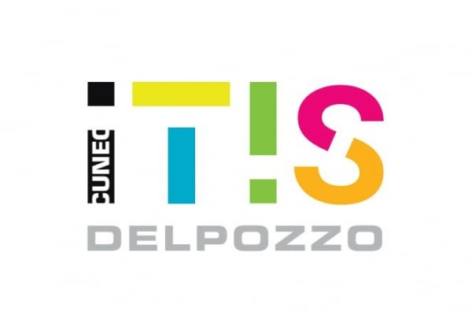

# AlphaBot

 

## Introduzione

Benvenuti nel progetto **BMO** di Torelli Luca e Giordano Pietro.

## Caratteristiche

- **Controllo remoto**: AlphaBot può essere controllato tramite una connessione di rete, consentendo agli utenti di interagire facilmente con il robot.
- **Movimento avanzato**: Supporta movimenti complessi utilizzando comandi direzionali, inclusi WASD e combinazioni di tasti.
- **Gestione delle connessioni**: Include funzionalità per gestire cadute improvvise della connessione, garantendo un funzionamento continuo.
- **Linguaggi di programmazione**: Python per la logica del robot e la gestione delle connessioni.
- **Protocolli di rete**: TCP/IP per la comunicazione tra client e server.

## Controlla lo stato di avanzamento
Essendo il progetto ancora in sviluppo puoi consultare lo stato di avanzamento consultando il file TODO.md nella root del progetto.

## Opzioni di collegamento
scp ./advanced_movement/alphabot_server.py  pi@192.168.1.149:esercizi
